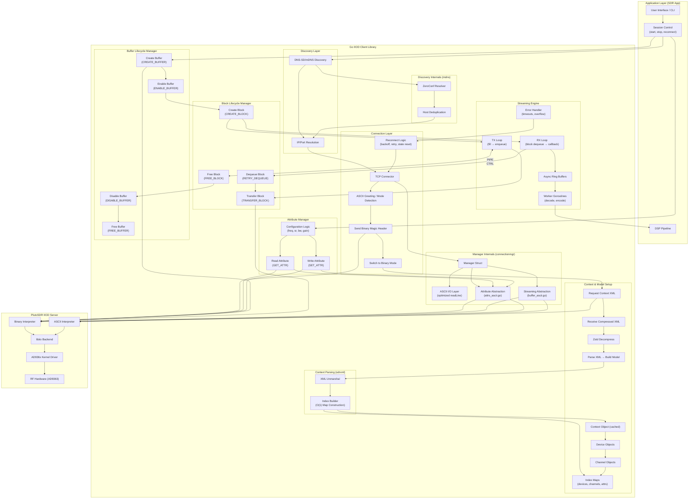

```mermaid
flowchart TD

%% =============================
%% APPLICATION LAYER
%% =============================
subgraph APP["Application Layer (SDR App)"]
    UI["User Interface / CLI"]
    CTRL["Session Control\n(start, stop, reconnect)"]
    PIPE["DSP Pipeline"]
end

%% =============================
%% CLIENT LIBRARY
%% =============================
subgraph CLIENT["Go IIOD Client Library"]

    %% --- Discovery ---
    subgraph DISC["Discovery Layer"]
        MDNS["DNS-SD/mDNS Discovery"]
        RESOLVE["IP/Port Resolution"]
    end

    %% --- Connection + Handshake ---
    subgraph CONN["Connection Layer"]
        TCP["TCP Connector"]
        ASCII_DET["ASCII Greeting / Mode Detection"]
        SEND_MAGIC["Send Binary Magic Header"]
        SWITCHBIN["Switch to Binary Mode"]
        RECONN["Reconnect Logic\n(backoff, retry, state reset)"]
    end

    %% --- XML + Context Setup ---
    subgraph CONTEXT["Context & Model Setup"]
        XMLREQ["Request Context XML"]
        XMLRX["Receive Compressed XML"]
        XMLDEC["Zstd Decompress"]
        XMLPARSE["Parse XML → Build Model"]
        CTXOBJ["Context Object (cached)"]
        DEVOBJ["Device Objects"]
        CHOBJ["Channel Objects"]
        MAPS["Index Maps\n(devices, channels, attrs)"]
    end

    %% --- Attribute Access ---
    subgraph ATTR["Attribute Manager"]
        READA["Read Attribute\n(GET_ATTR)"]
        WRITEA["Write Attribute\n(SET_ATTR)"]
        CFGFLOW["Configuration Logic\n(freq, sr, bw, gain)"]
    end

    %% --- Buffer Lifecycle ---
    subgraph BUFL["Buffer Lifecycle Manager"]
        BUFCREATE["Create Buffer\n(CREATE_BUFFER)"]
        BUFENABLE["Enable Buffer\n(ENABLE_BUFFER)"]
        BUFDISABLE["Disable Buffer\n(DISABLE_BUFFER)"]
        BUFFREE["Free Buffer\n(FREE_BUFFER)"]
    end

    %% --- Block Lifecycle ---
    subgraph BLKL["Block Lifecycle Manager"]
        BLOCKCREATE["Create Block\n(CREATE_BLOCK)"]
        BLOCKXFER["Transfer Block\n(TRANSFER_BLOCK)"]
        BLOCKDEQ["Dequeue Block\n(RETRY_DEQUEUE)"]
        BLOCKFREE["Free Block\n(FREE_BLOCK)"]
    end

    %% --- Streaming Engine ---
    subgraph STREAM["Streaming Engine"]
        RXLOOP["RX Loop\n(block dequeue → callback)"]
        TXLOOP["TX Loop\n(fill → enqueue)"]
        RING["Async Ring Buffers"]
        WORKERS["Worker Goroutines\n(decode, encode)"]
        ERR["Error Handler\n(timeouts, overflow)"]
    end

    %% =============================
    %% NEW: Detailed ASCII & Manager Architecture
    %% =============================
    subgraph MGR_DETAIL["Manager Internals (connectionmgr)"]
        MGR["Manager Struct"]
        ASCII_IO["ASCII I/O Layer\n(optimized readLine)"]
        ATTR_AL["Attribute Abstraction\n(attrs_ascii.go)"]
        STREAM_AL["Streaming Abstraction\n(buffer_ascii.go)"]
    end

    subgraph DISC_DETAIL["Discovery Internals (mdns)"]
        ZEROCONF["ZeroConf Resolver"]
        HOSTMAP["Host Deduplication"]
    end

    subgraph CTX_DETAIL["Context Parsing (sdrxml)"]
        UNMARSHAL["XML Unmarshal"]
        IDXBUILD["Index Builder\n(O(1) Map Construction)"]
    end

end

%% =============================
%% IIOD SERVER (PLUTO)
%% =============================
subgraph IIOD["PlutoSDR IIOD Server"]
    ASCII_S["ASCII Interpreter"]
    BINARY_S["Binary Interpreter"]
    LIBIIO["libiio Backend"]
    KDRV["AD936x Kernel Driver"]
    HW["RF Hardware (AD9363)"]
end

%% =============================
%% DATA FLOW
%% =============================

%% App -> Client
UI --> CTRL
CTRL --> MDNS --> RESOLVE --> TCP

%% Discovery Detail
MDNS --> ZEROCONF --> HOSTMAP --> RESOLVE

%% Connection + handshake
TCP --> ASCII_DET --> SEND_MAGIC --> SWITCHBIN

%% Manager Integration
TCP --> MGR
MGR --> ASCII_IO
MGR --> ATTR_AL --> ASCII_S
MGR --> STREAM_AL --> ASCII_S

%% After mode switch, start XML build
SWITCHBIN --> XMLREQ --> XMLRX --> XMLDEC --> XMLPARSE
XMLPARSE --> UNMARSHAL --> IDXBUILD --> CTXOBJ
IDXBUILD --> MAPS
CTXOBJ --> DEVOBJ --> CHOBJ --> MAPS

%% Attribute config stage
CTRL --> CFGFLOW
CFGFLOW --> READA
CFGFLOW --> WRITEA
READA --> ATTR_AL
WRITEA --> ATTR_AL

%% Buffer + block state machine
CTRL --> BUFCREATE --> BUFENABLE
BUFENABLE --> BLOCKCREATE

BLOCKCREATE --> RXLOOP
BLOCKCREATE --> TXLOOP

RXLOOP --> BLOCKDEQ --> BLOCKXFER
TXLOOP --> BLOCKXFER

%% Async pipeline
RXLOOP --> RING --> WORKERS --> PIPE
TXLOOP <-- PIPE

%% Shutdown sequence
CTRL --> BLOCKFREE --> BUFDISABLE --> BUFFREE

%% Fault handling
ERR --> RECONN --> TCP

%% IIOD Interaction
SEND_MAGIC --> BINARY_S
XMLREQ --> BINARY_S
READA --> BINARY_S
WRITEA --> BINARY_S
BUFCREATE --> BINARY_S
BLOCKXFER --> BINARY_S

%% Detailed ASCII Interaction
ATTR_AL --> ASCII_S
STREAM_AL --> ASCII_S

BINARY_S --> LIBIIO --> KDRV --> HW
ASCII_S --> LIBIIO
```
